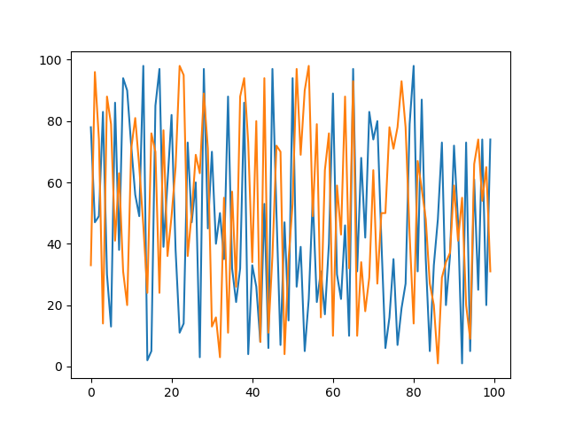
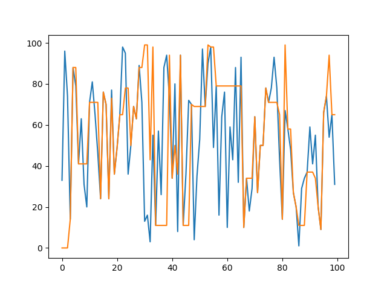
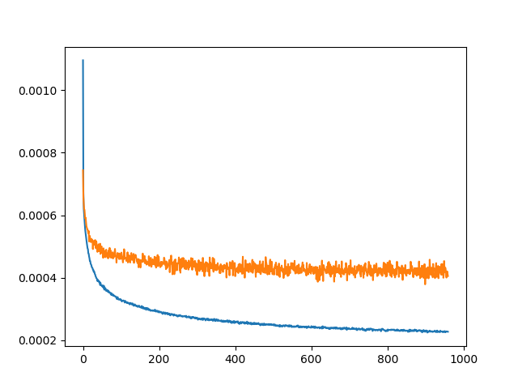

# Simple Transformer

An implementation of the "Attention is all you need" paper without extra bells and whistles,
or difficult syntax.

### Install
```
python -m pip install -r requirements.txt
```

### Toy dataset
```
python train_toy_data.py
```

| Before      | After 100 Epoch |
| ----------- | ----------- |
|   |      |

### English -> German Europarl dataset
```
python train_translate.py
```

Training on a small subset of 1000 sentences (Included in this repo)



