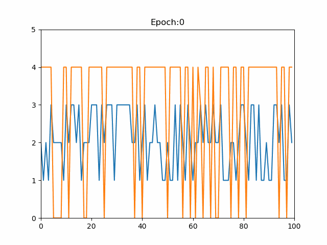
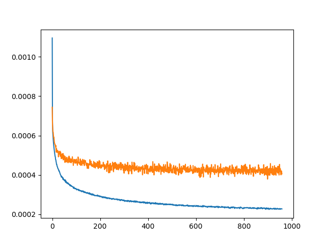

# Simple Transformer

An implementation of the "Attention is all you need" paper without extra bells and whistles,
or difficult syntax.

Note: The only extra thing added is Dropout regularization in some layers and option to use GPU. Also, a lot more steps might be needed to get the model to work very well. For instance, improving the inference speed, or have a schedule to shift away from teacher forcing. I haven't experimented much with those, and this repository is meant for a reference to the basic transformer setup. It's complementary to other blog posts/videos/paper one might find online.

### Install
```
python -m pip install -r requirements.txt
```

### Toy data
```
python train_toy_data.py
```



### English -> German Europarl dataset
```
python train_translate.py
```

Training on a small subset of 1000 sentences (Included in this repo)



